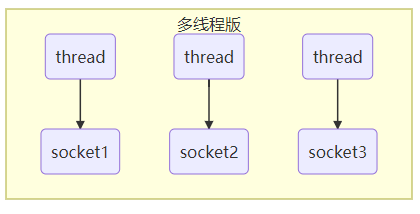
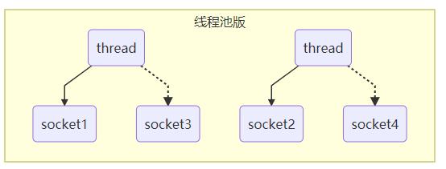
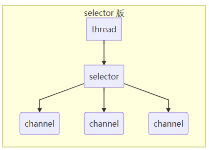
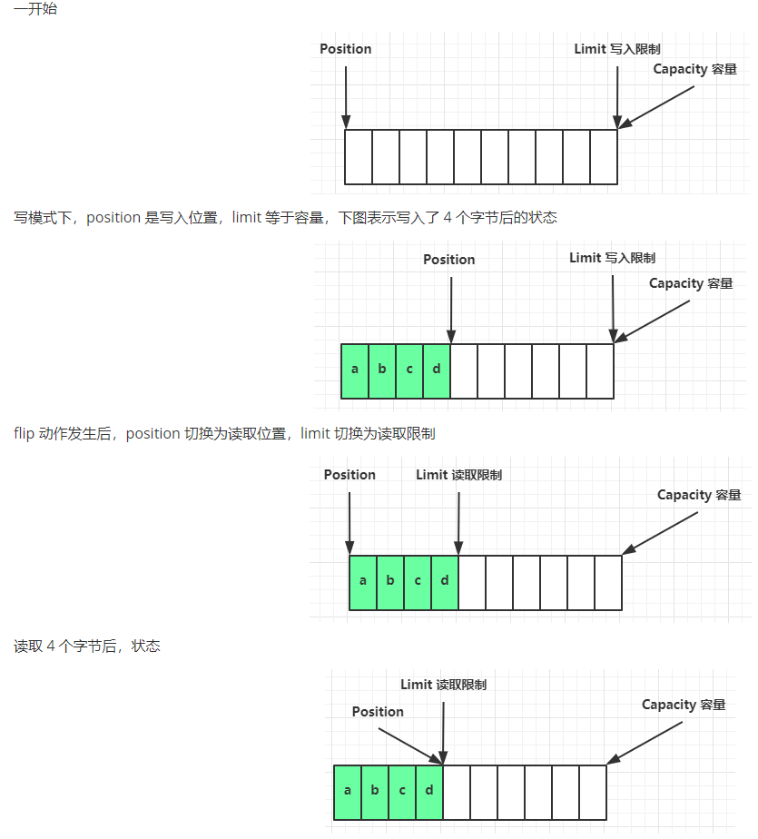
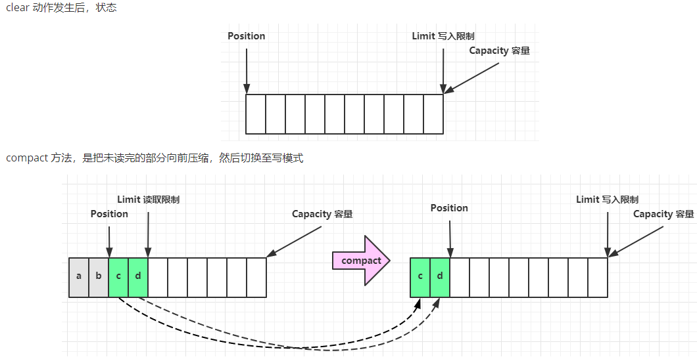

##  NIO non-blocking io 非阻塞IO
### Channel & Buffer
读写的双向通道，可以从channel读入buffer，也可以从buffer写入channel，于stream相似

### Selector

 
+ 内存占用高
+ 线程上下文切换成本高
+ 只适合连接数少的场景

 
+ 非阻塞模式下只能处理一个socket连接
+ 适用于短连接场景

> selector配合一个线程管理多个channel，获取channel发生的事件，这些channel工作在非阻塞模式下，不会让一个线程吊死在一个channel上。适合连接数特别多，但流量低的场景。

### ByteBuffer结构

